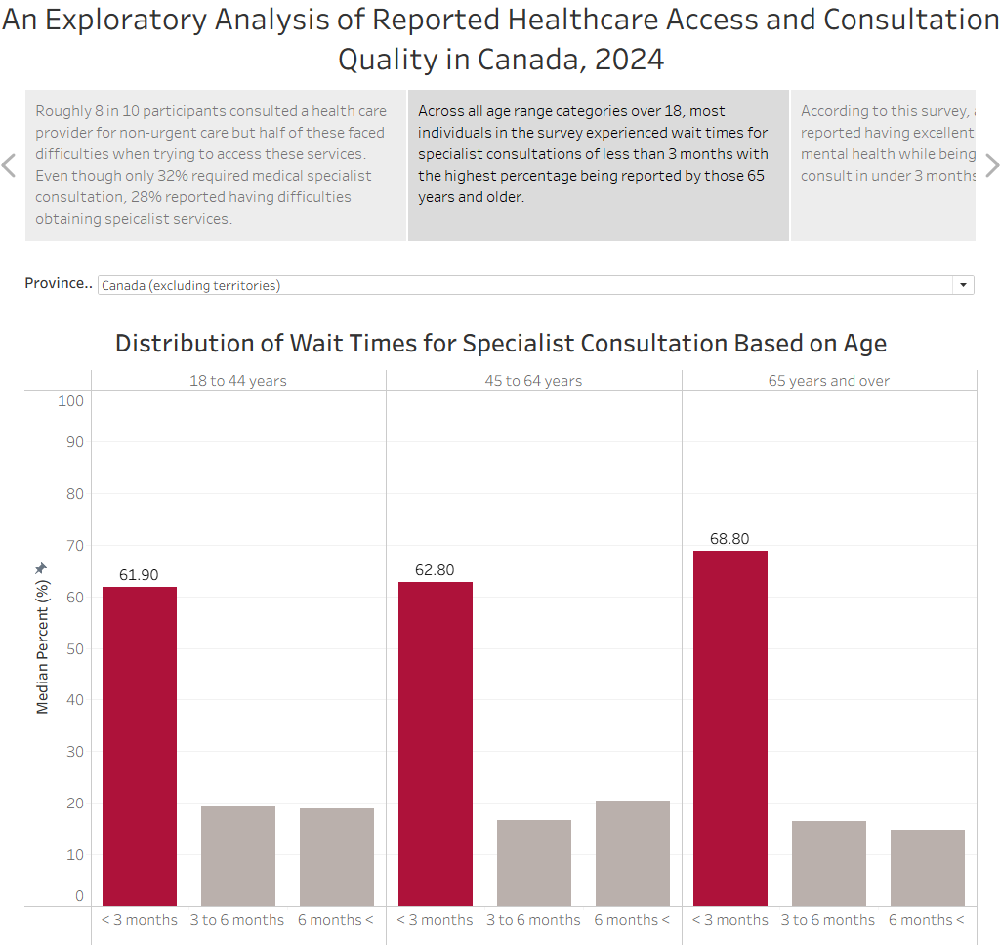
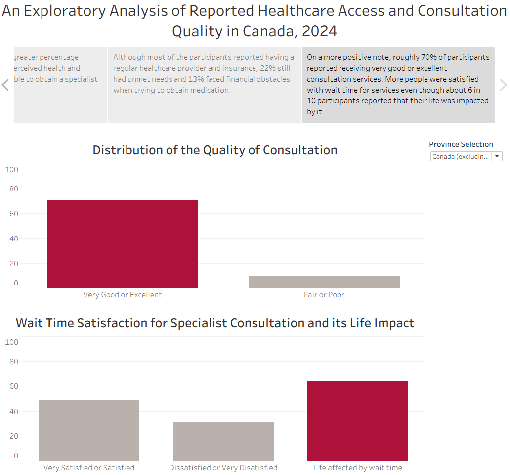

# HEALTHCARE ACCESS AND PATIENT EXPERIENCE IN CANADA, 2024 

## Project 
In this project, exploratory data analysis was conducted using data collected from two 2024 surveys on healthcare access and wait times for initial medical specialist consultations across Canada. The findings were summarized in an interactive Tableau story. 

## Tools Used

- Postgres SQL for data cleaning 
- Tableau Public for visualization

## Data Preparation
### Data sources
[Health indicators, survey on health care access and experiences and specialist care in 2024](https://www150.statcan.gc.ca/t1/tbl1/en/tv.action?pid=1310096201)
[Wait time for an initial consultation with a medical specialist in 2024](https://www150.statcan.gc.ca/t1/tbl1/en/tv.action?pid=1310096101) 

### Data Cleaning
Data preprocessing was performed using SQL and included: 
- Dropping unreliable data
- Handling missing values 
- Preparing required fields for visualization 

## Interactive Tableau Story

[View the dashboard on Tableau Public](https://public.tableau.com/views/HealthcareAccessandPatienceExperienceinCanada2024/Story1?:language=en-US&:sid=&:redirect=auth&:display_count=n&:origin=viz_share_link)

## Key findings

- Most people are able to obtain specialist consultations in under 3 months regardless of age
- Less than 20% of the participants reported having low perceived health and mental health
- Most of the participants had a regular healthcare provider and had prescription medication covered by insurance, however, 
22% reported having unmet healthcare needs and 13% experienced financial difficulty when trying to maintain their prescriptions.
- Even though 6 in 10 participants reported their lives being impacted by the wait time for a specialist consultation, 50% reported being
satisfied with the wait period and 7 in 10 participants reported receiving very good/ excellent quality of consultation

## Dashboard Preview
### Age Distribution Dashboard

### Wait time and Specialist Consultation Quality Dashboard

